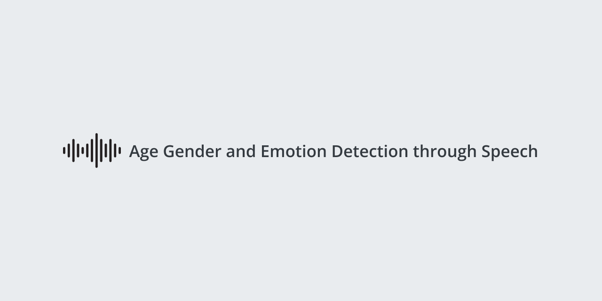

<br>
<h1 align="center"> </h1> 
<br>

<h4 align="center"> Experiments that analyze speech data to detect the speaker's age, gender, and emotional state. </h4>
<br>
<p align ="center">
  <a href="https://www.tensorflow.org/">  </a> <a href="https://matplotlib.org/">  </a> <a href="">  </a>
</p>
<br>
<h1> Table of Contents </h1>
<p align="left">
  • <a href="#Requirements"> Requirements </a> <br>
  • <a href="#Preprocessing"> Preprocessing </a> <br>
  • <a href="#Experiment-List"> Experiment List </a> <br>
</p> <br>

## Requirements 
If you happen to be running this on your local environment, use the following command: 
```bash
$ pip install -r requirements.txt 
```
```python 3.10.12``` was used for these experiments. <br>
```tensorflow 2.12.0``` was used to create the model architectures. <br><br>

## Preprocessing

 • ```Feature_Extractor.ipynb```  : Combining emodb with crema-d and generating features (Is used to generate the below mentioned csv files) <p align=right> <a href="/preprocessing/Feature_Extractor.ipynb"> </a>  </p> <br>
 • ```features_age_emotion.csv``` : Contains voice features generated from crema-d and emodb combined together along with age, gender and emotion labels <a href="/preprocessing/features_age_emotion.csv" > <br> <p align=right>  </a> </p> <br>
 • ```features_emotion_final.csv``` : Contains voice features generated from crema-d and emodb combined together along with emotion label <br>
 • ```features_age_final.csv``` : Contains voice features generated from crema-d and emodb combined together along with age label <br>
 • ```features_gender_final.csv``` : Contains voice features generated from crema-d and emodb combined together along with gender label <br>
 <a href=" https://drive.google.com/drive/folders/1ZpfFt_PDD7NjyXYEVqKqQ70jifF6doc0?usp=drive_link" > <br> <p align=right>   </p> </a> <br> <br>
 
## Experiment List 
<p align="left">
  • <a href="#Set-1"> Set-1: Individual models predicting one output variable </a> <br>
  • <a href="#Set-2"> Set-2: Individual models predicting all three output variables </a> <br>
  • <a href="#Set-3"> Set-3: Sequential models predicting three outputs in a sequence (MLP) </a> <br>
  • <a href="#Set-4"> Set-4: Sequential models predicting three outputs in a sequence (CNN) </a> <br>
  • <a href="#Set-5"> Set-5: Attention based CNNs </a> <br>
</p>

## Set-1
<h4 align="center"> Individual models predicting one output variable </h4> <br>
<p align ="center">
  <a href="/models/Individual">  </a>
</p> <br>
* This set contains experiments where models were trained to predict one output variable from only the voice features as input. <br>
* It also contains experiments where models were trained to predict one output variable with the other two variables as input along with the voice features. (eg. predicting emotion with age and gender along with voice features as input) <br> <br>

<p align="center">
   <br> 
</p>

## Set-2 
<h4 align="center"> Individual models predicting all three output variables </h4> <br>
<p align ="center">
  <a href="/models/Monolithic">  </a>
</p> <br>
* Here, the experiments are carried out such that all three output variables are predicted by the output layer of the model with common hidden (MLP) and convolution (CNN) layers <br>
* Two different models have been experimented on: <br>
  1. MLP <br>
  2. CNN <br>
  
<p align="center">
   <br> 
</p>


## Set-3
<h4 align="center"> Sequential models predicting three outputs in a sequence (MLP) </h4> <br>
<p align ="center">
  <a href="/models/Sequential">  </a>
</p> <br>
* Here, the experiments are carried out such that one MLP model (model 1) is trained to predict output variable y1, then, another MLP model (model 2) is trained on the voice features and predicted y1 to predict y2, after which another MLP model (model 3) is trained on the voice features and predicted y2 to predict y3. 
<p align="center">
   <br> 
</p>

## Set-4
<h4 align="center"> Sequential models predicting three outputs in a sequence (CNN) </h4> <br>
<p align ="center">
  <a href="/models/Sequential">  </a>
</p> <br>
* Here, the experiments are carried out such that one CNN model (model 1) is trained to predict output variable y1, then, another CNN model (model 2) is trained on the voice features and predicted y1 to predict y2, after which another CNN model (model 3) is trained on the voice features and predicted y2 to predict y3. 
<p align="center">
   <br> 
</p>

## Set-5
<h4 align="center"> Attention based CNNs </h4> <br>
<p align ="center">
  <a href="/models/Attention">  </a>
</p> <br>
* Here, the experiments are carried out such that attention layers with different parameters are trained and tested
<p align="center">
   <br> 
</p>
  
